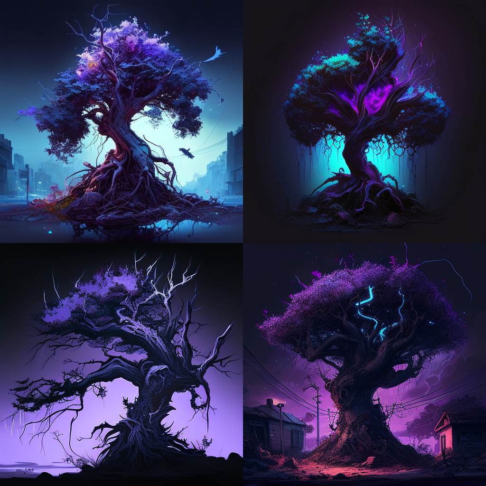

## Prompts

Helpers and lists to generate a variety of prompts for AI image generation

There are [many lists](https://github.com/fofr/prompts/tree/main/lists). PRs to add more are welcome.

```js
const number = 10
for (let i = 0; i < number; i++) {
  prompts.push(`${h.item('scenes')}, ${h.color()}, ${h.item('style')}, ${h.item('genre')}`)
}
```

```
> node index.js

serengeti, muted magenta, visionary hypermaximalism, sci-fi
national park, bright ivory, depiction, fantasy
canyon, metallic purple, 2d game art, film noir
tree, very dark periwinkle, digital painting, cyberpunk dystopia
treetops, radiant beige, tempera painting, neoclassical
national park, neon azure, 2d game art, cyber-medieval
rainforest, strong beige, pastel painting, dark fantasy
rainforest, dark ultramarine, digital painting, mid-century
sinkhole, metallic teal, unreal engine render, fantasy noir
valley, radiant yellow, rendered in zbrush, synthwave
```

<details>
  <summary>Example image</summary>

  `tree, very dark periwinkle, digital painting, cyberpunk dystopia`
  
</details>

### Install

Clone this repository and run:

`npm install`

### Generate prompts

```
node index.js
```

Copy prompts to clipboard:
```
node index.js | pbcopy
```

### Write prompts

Compose your prompts in `index.js`.

There are a number of helpers:

#### h.item(list, count)

Pick random items from any list. Count defaults to 1.

```js
prompts.push(`${h.item('style')}`)
// oil painting

prompts.push(`${h.item('style', 2)}`)
// artistic photograph, baroque painting
```

#### h.list(list)

Get an entire list to loop over

In this example a prompt will be made for every type of genre

```js
h.list('genre').forEach((g) => {
  prompts.push(`a ${g} painting`)
  // a cyberpunk painting
})
```

Combine `h.item` and `h.list`:

```js
h.list('genre').forEach((g) => {
  prompts.push(`a ${g} painting of a ${h.item('mammal')}`)
  // a cyberpunk painting of a tiger
  // a steampunk painting of a lion
  // ...
})
```

#### h.lists([list1, list2])

Get multiple lists to loop over

```js
h.lists(['sea-creatures', 'mammals']).forEach((a) => {
  prompts.push(`a painting of a ${a}`)
  // a painting of a jellyfish
  // ...
})
```

#### h.shuffle(prompts)

Shuffle the list of prompts.

```js
h.shuffle(prompts)
```

#### h.adjectiveNoun()

Get a random adjective noun pairing.

```js
prompts.push(`a ${h.adjectiveNoun()}`)
// a laden transcript
```

#### h.year(min, max)

Get a random year. `min` defaults to 1890, `max` defaults to `2050`

```js
prompts.push(`a photo taken in ${h.year()}`)
// a photo taken in 1952

prompts.push(`a photo taken in ${h.year(2010, 2020)}`)
// a photo taken in 2017
```

#### h.century(min, max)

Get a random century. `min` defaults to 10, `max` defaults to `25`

```js
prompts.push(`a painting from ${h.century()}`)
// a painting from 1600

prompts.push(`a painting from ${h.century(17, 20)}`)
// a painting from 1900
```

#### h.country()

Return a random [country](https://fakerjs.dev/api/address.html#country) using `fakerjs`

```js
prompts.push(`a photo of a street in ${h.country()}`)
// a photo of a street in Canada
```

#### h.name()

Return a random [name](https://fakerjs.dev/api/name.html#fullname) using `fakerjs`

```js
prompts.push(`a photo of ${h.name()}`)
// a photo of Allen Brown
```

#### h.jobTitle()

Return a random [jobTitle](https://fakerjs.dev/api/name.html#jobtitle) using `fakerjs`

```js
prompts.push(`a photo of a ${h.jobTitle()}`)
// a photo of a global accounts engineer
```

#### h.jobType()

Return a random [jobType](https://fakerjs.dev/api/name.html#jobtype) using `fakerjs`

```js
prompts.push(`a photo of a ${h.jobType()}`)
// a photo of a designer
```

#### h.color(count)

Get a random color with a random modifier. Count defaults to 1.

```js
prompts.push(`a ${h.color()} fish`)
// a bright blue fish

prompts.push(`a ${h.color(2)} fish`)
// a bright blue, radiant crimson fish
```

#### h.animal(count)

Shorthand to get a random animal. Count defaults to 1.

```js
prompts.push(`a painting of a ${h.animal()}`)
// a painting of a tiger

prompts.push(`a painting by ${h.animal(2)}`)
// a painting of a tiger, lion
```

#### h.artist(count)

Shorthand to get a random artist. Count defaults to 1.

#### h.trending(count)

Shorthand to get a random ‘trending on X’. Count defaults to 1.

### Update lists

Add to existing  files `lists/*.txt` or create new ones then run:

```
node sanitise-lists.js
```

This will:

- remove duplicates
- lowercase strings (in most cases)
- sort alphabetically
